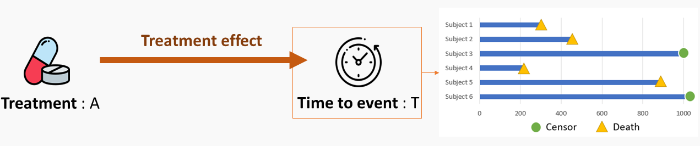

## Under review: Estimation of the Average Treatment Effect in Causal Survival Analysis: Practical Recommendations




<a href="https://arxiv.org/abs/2501.05836" target="_blank">arXiv Preprint</a> | <a href="https://github.com/Sanofi-Public/causal_survival_analysis" target="_blank">Code</a><br> 

Causal survival analysis combines survival analysis and causal inference to evaluate the effect of a treatment or intervention on a time-to-event outcome, such as survival time. It offers an alternative to relying solely on Cox models for assessing these effects. In this paper, we present a comprehensive review of estimators for the average treatment effect measured with the restricted mean survival time, including regression-based methods, weighting approaches, and hybrid techniques. We investigate their theoretical properties and compare their performance through extensive numerical experiments. Our analysis focuses on the finite-sample behavior of these estimators, the influence of nuisance parameter selection, and their robustness and stability under model misspecification. By bridging theoretical insights with practical evaluation, we aim to equip practitioners with both state-of-the-art implementations of these methods and practical guidelines for selecting appropriate estimators for treatment effect estimation. Among the approaches considered, G-formula two-learners, AIPCW-AIPTW, Buckley-James estimators, and causal survival forests emerge as particularly promising.

----


```{=html}
<div  style="margin: 30px; text-align: center;">
<a class="btn btn-primary" href="https://team.inria.fr/premedical/" role="button" target="_blank" style="padding: 15px 30px;">I want to know more about the PreMeDICaL Team</a>
</div>
```
